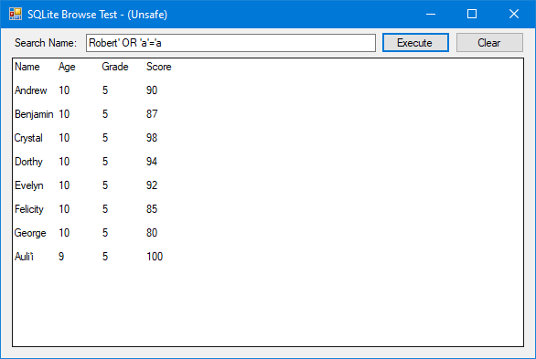
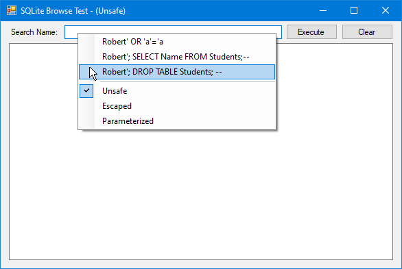

# SQL-InjectionTest #
Windows Forms desktop app purposely containing a SQL Injection security flaw using an in-memory SQLite database. Intended to test static security code scanning tools.

(XKCD Web Comic - Source of inspiration and humor)

 
 
 [https://xkcd.com/327/](https://xkcd.com/327/)  

(Basic app, showing all database info being dumped via SQL Injection)

(Example of embedded SQL Injections accessible via context menu in input field.)

Created by Taber with a computer.
